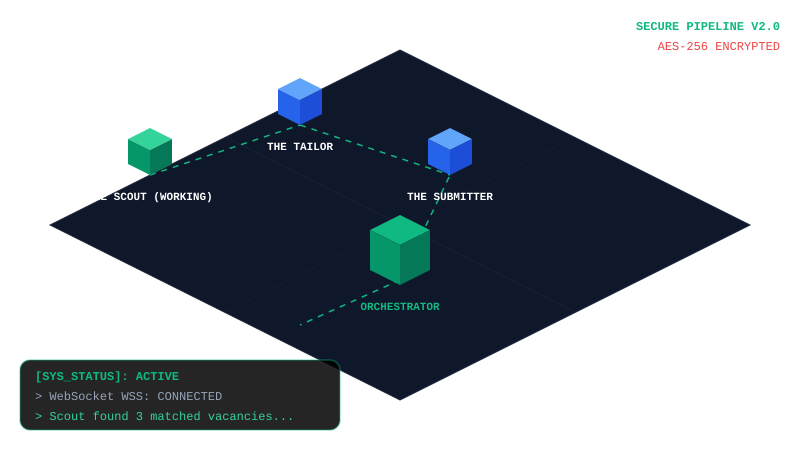
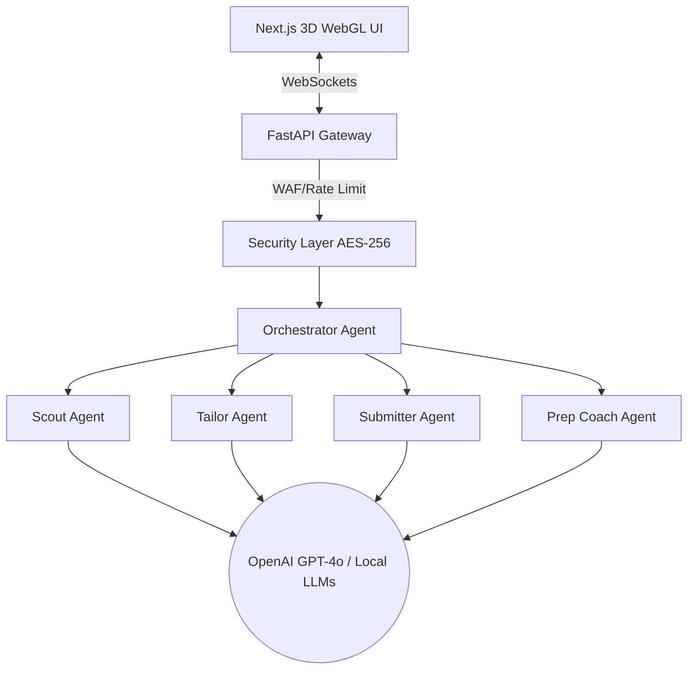

# 🌐 Multi AI Job Prep Agents 🚀

<div align="center">

[](https://opensource.org/licenses/MIT)
[](https://www.python.org/downloads/)
[](https://nextjs.org/)
[](https://docs.pmnd.rs/react-three-fiber/)
[](https://crewai.com/)
[]()

*Un sistema hiperrealista de inteligencia artificial multiagente en 3D diseñado para automatizar todo el proceso de búsqueda y solicitud de empleo.*

[English](README.md) • [Español](README.es.md) • [中文](README.zh.md)

</div>

---

## 🎮 Motor del Espacio de Trabajo 3D (Visualizador Dinámico en Tiempo Real)

A continuación se muestra la simulación en vivo del **Lienzo WebGL 3D Isométrico** ejecutándose en tiempo real. ¡Observa cómo los cubos respiran, rebotan y pulsan a lo largo de la tubería neuronal!

<div align="center">
  
</div>

---

## 🏗️ Arquitectura del Sistema

Nuestra arquitectura de orquestación multiagente procesa las ofertas de empleo de manera continua, desde la detección de vacantes hasta la generación de documentos:



---

## 🛠️ Módulos del Framework

Haz clic en las secciones a continuación para inspeccionar las capas del sistema y sus detalles:

<details>
<summary><b>🧠 1. Núcleo de IA Multiagente (CrewAI y LangChain)</b></summary>
<br>

El núcleo de la aplicación es un pipeline paralelo de 7 agentes configurado en `backend/app/agents/crew.py`. Cada agente opera con una personalidad específica:

*   **🕵️ El Explorador (Scout):** Identifica vacantes de empleo que coincidan con tus filtros.
*   **👔 El Sastre (Tailor):** Reescribe y adapta el currículum del candidato para superar la barrera del 94% en los filtros ATS.
*   **📝 El Solucionador de Problemas (Problem Solver):** Resuelve evaluaciones técnicas y preguntas complejas en los formularios.
*   **📂 El Archivista (Archivist):** Categoriza de forma segura todos los archivos en formato PDF, JSON o Word.
*   **🔄 El Reciclador (Recycler):** Genera cachés locales para acelerar aplicaciones de empleo similares en el futuro.
</details>

<details>
<summary><b>🎮 2. Capa del Lienzo WebGL Interactivo (React Three Fiber y Three.js)</b></summary>
<br>

Nuestra interfaz utiliza un lienzo 3D isométrico que traduce la telemetría en vivo del WebSocket en respuestas visuales físicas:
*   **Sombreadores de Movimiento Dinámico:** Los elementos rotan y flotan asíncronamente mediante bucles de física `useFrame` para asegurar 60 FPS estables.
*   **Controles de Órbita:** Soporte para zoom, arrastre y límites de cámara personalizados en el viewport.
*   **Superposiciones HTML Reactivas:** Tooltips dinámicos siguen a los agentes 3D en tiempo real reflejando sus estados `IDLE`, `WORKING` o `ERROR`.
</details>

<details>
<summary><b>🔒 3. Pila de Seguridad Zero-Trust (AES-256 y SlowAPI)</b></summary>
<br>

El sistema implementa estrictos controles de seguridad para proteger los datos personales del candidato:
*   **Cifrado AES-256 en Reposo:** Todos los documentos y credenciales se encriptan al escribirse usando claves simétricas en `backend/app/core/security.py`.
*   **Cortafuegos (WAF) Throttling:** La API implementa SlowAPI para limitar peticiones (100 por minuto) y prevenir ataques de denegación de servicio (DDoS).
*   **Política Estricta de CORS:** El gateway FastAPI rechaza cualquier origen que no sea el puerto frontend `3000`.
</details>

---

## 💻 Guías de Configuración para Diferentes Plataformas

### 1. Sistemas Windows (PowerShell y Símbolo del Sistema)

Para inicializar el entorno virtual y ejecutar los servicios localmente en Windows:

```powershell
# Abre una consola y navega al directorio del backend
cd backend

# Crea el entorno virtual (si no se ha creado)
python -m venv venv

# En PowerShell, habilita la ejecución de scripts
Set-ExecutionPolicy -Scope Process -ExecutionPolicy Bypass

# Activa el entorno virtual
.\venv\Scripts\activate

# Sincroniza las dependencias
pip install -r requirements.txt

# Inicia el servidor FastAPI
uvicorn app.main:app --reload --port 8000
```

*Configuración del Frontend:*
```cmd
cd frontend
npm install
npm run dev
```

---

### 2. Sistemas macOS y Linux (Bash y Zsh)

Asegúrate de contar con Python 3.10+ configurado en el sistema antes de iniciar:

```bash
# Navega al directorio del backend
cd backend

# Crea el entorno virtual
python3 -m venv venv

# Activa el entorno virtual
source venv/bin/activate

# Instala dependencias
pip install --upgrade pip
pip install -r requirements.txt

# Inicia el servidor local
uvicorn app.main:app --reload --port 8000
```

*Configuración del Frontend:*
```bash
cd frontend
npm install
npm run dev
```

---

### 3. Implementaciones en Contenedores (Docker y Docker Compose)

Para ejecutar toda la pila (tanto frontend como backend) de forma unificada en cualquier sistema operativo usando Docker:

```bash
# Desde el directorio raíz (que contiene docker-compose.yml)
docker-compose up --build
```
Docker compilará automáticamente las imágenes de backend (`http://localhost:8000`) y frontend (`http://localhost:3000`) estableciendo la comunicación por WebSockets en red interna.

---

## 📊 Matriz de Operaciones de Agentes

Technical breakdown of the 8 coordinated agents managed in the orchestrator:

| Identificador | Rol de Agente | Objetivo Operacional | Mensaje de Telemetría |
| :--- | :--- | :--- | :--- |
| `agent_1_scout` | El Explorador | Buscar ofertas que coincidan con filtros. | `"Scouted target vacancies matching..."` |
| `agent_2_tailor` | El Sastre | Optimizar el currículum para superar filtros ATS. | `"Tailored resume for matching keywords. ATS: 97%"` |
| `agent_3_submitter` | El Remitente | Compilar plantillas y preparar payloads de envío. | `"Prepared submission payload..."` |
| `agent_3_1_solver` | Solucionador | Resolver evaluaciones y exámenes técnicos. | `"Generated answers for technical assessments."` |
| `agent_4_coach` | Entrenador | Generar cartas de presentación y guías de entrevista. | `"Generated cover letter and custom prep links."` |
| `agent_5_archivist` | El Archivista | Organizar y guardar archivos de salida de forma segura. | `"Archived tailored resume and prep guides."` |
| `agent_6_recycler` | El Reciclador | Almacenar respuestas y palabras clave útiles. | `"Updated cache repositories with keyword patterns."` |
| `agent_7_orchestrator` | Orquestador | Sincronizar sockets en vivo y ejecutar la Crew. | `"Pipeline successfully completed."` |

---

## 🔌 Especificación de API Gateway y WebSocket

Servicios expuestos en el backend bajo control de SlowAPI. Haz clic en las pestañas para ver los detalles:

<details>
<summary><b>📡 1. POST /api/trigger-pipeline (Multipart Form Data)</b></summary>
<br>

Utilizado por la interfaz para enviar solicitudes de empleo y currículums adjuntos.

*   **Tipo de Petición:** `POST`
*   **Cabeceras:** `Content-Type: multipart/form-data`
*   **Parámetros:**
    *   `jobDescription` (string, Requerido): Descripción de la vacante.
    *   `resume` (Archivo, Opcional): El documento de currículum base.
*   **Respuesta (200 OK):**
    ```json
    {
      "message": "Pipeline triggered successfully. Watch the 3D UI!"
    }
    ```
</details>

<details>
<summary><b>📡 2. WS /ws/agents (Conexión WebSocket)</b></summary>
<br>

Transmite logs en vivo y expedientes técnicos de preparación al lienzo 3D.

*   **URL de Conexión:** `ws://localhost:8000/ws/agents`
*   **Esquema de Estado del Agente:**
    ```json
    {
      "agent_id": "agent_1_scout",
      "status": "WORKING",
      "message": "The Scout is actively processing..."
    }
    ```
*   **Esquema de Fin de Pipeline (`PIPELINE_COMPLETE`):**
    ```json
    {
      "event": "PIPELINE_COMPLETE",
      "atsMatchScore": 97,
      "jobTitle": "React 19 Frontend Lead",
      "coverLetter": "Dear Hiring Manager...",
      "technicalAnswers": [
        { "q": "Question text...", "a": "Answer text..." }
      ],
      "prepLinks": [
        { "title": "LeetCode Algorithmic Route", "url": "https://..." }
      ]
    }
    ```
</details>

---

## 🛠️ Guía de Diagnóstico y Resolución de Problemas

Si experimentas problemas durante la ejecución, despliega las secciones para ver las soluciones:

<details>
<summary><b>🔍 1. Pydantic ValidationError (Conflictos de Dependencia)</b></summary>
<br>

*   **Síntoma:** El backend falla al arrancar indicando: `pydantic_core._pydantic_core.ValidationError: 2 validation errors for Agent`.
*   **Causa:** Las librerías LangChain y CrewAI están desalineadas en tu entorno virtual local, causando un fallo de validación en la propiedad `llm` bajo Pydantic v2.
*   **Solución:** Sincroniza las dependencias en tu entorno virtual:
    ```powershell
    .\venv\Scripts\activate
    pip install --upgrade crewai langchain-core langchain-openai
    ```
</details>

<details>
<summary><b>🔍 2. Conflicto de Puerto (Address Already in Use)</b></summary>
<br>

*   **Síntoma:** El backend o frontend muestran `listen EADDRINUSE: address already in use :::8000` o `:::3000`.
*   **Causa:** Un proceso anterior de uvicorn o next dev sigue activo en segundo plano.
*   **Solución:** Termina el proceso ocupante desde Windows PowerShell:
    ```powershell
    # Liberar puerto 8000
    Get-Process -Id (Get-NetTCPConnection -LocalPort 8000).OwningProcess | Stop-Process -Force
    
    # Liberar puerto 3000
    Get-Process -Id (Get-NetTCPConnection -LocalPort 3000).OwningProcess | Stop-Process -Force
    ```
</details>

<details>
<summary><b>🔍 3. WebSocket Desconectado (WSS en estado "disconnected")</b></summary>
<br>

*   **Síntoma:** El HUD del panel muestra `WSS: disconnected` en color rojo.
*   **Causa:** El servidor de FastAPI no se está ejecutando o los puertos de CORS están bloqueados.
*   **Solución:** Comprueba que `uvicorn` se está ejecutando en `http://localhost:8000` y revisa las políticas de CORS en `backend/app/main.py`.
</details>
