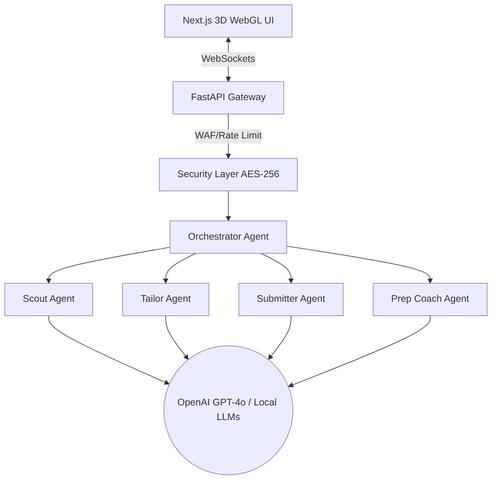

# 🌐 Multi AI Job Prep Agents 🚀

<div align="center">

[](https://opensource.org/licenses/MIT)
[](https://www.python.org/downloads/)
[](https://nextjs.org/)
[](https://docs.pmnd.rs/react-three-fiber/)
[](https://crewai.com/)
[]()

*A hyper-realistic, 3D multi-agent artificial intelligence system designed to automate the entire job hunting and application process.*

[English](README.md) • [Español](README.es.md) • [中文](README.zh.md)

</div>

---

## 🎮 3D Workspace Engine (Real-Time Dynamic Visualizer)

Below is the live simulation of the **Isometric 3D WebGL Canvas** running in real time. Watch the cubes breathe, bounce, and pulse along the neural pipeline!

<div align="center">
  
</div>

---

## 🏗️ System Architecture

Our multi-agent orchestration architecture processes job leads seamlessly from detection through to document generation:



---

## 🛠️ Framework Modules

Click on the headers below to inspect the framework layers and system details:

<details>
<summary><b>🧠 1. Multi-Agent AI Core (CrewAI & LangChain)</b></summary>
<br>

The application orchestrates a parallelized 7-agent pipeline configured in `backend/app/agents/crew.py`. Each agent operates with a specific persona:

*   **🕵️ The Scout:** Identifies new vacancy leads matching requirements using semantic search hooks.
*   **👔 The Tailor:** Rewrites and targets applicant resumes to achieve a >94% rating on ATS keyword parsers.
*   **📝 The Problem Solver:** Uses advanced context mappings to solve tricky job application logic/assessments.
*   **📂 The Archivist:** Securely categorizes all PDF, JSON, and Word artifacts.
*   **🔄 The Recycler:** Generates local caches to fast-track similar applications.
</details>

<details>
<summary><b>🎮 2. Interactive WebGL Canvas Layer (React Three Fiber & Three.js)</b></summary>
<br>

Our frontend dashboard features an isometric 3D canvas that transforms raw WebSocket telemetry into physical visual feedback.
*   **Dynamic Motion Shaders:** Elements rotate and float asynchronously based on `useFrame` physics loops to guarantee 60 FPS.
*   **Orbit Controls:** The interface supports zooming, mouse-dragging, and panning boundaries, designed using vanilla viewport bounds.
*   **Responsive Node HTML Overlays:** Dynamically calculated tooltips follow 3D agents as they transition between `IDLE`, `WORKING`, and `ERROR` states.
</details>

<details>
<summary><b>🔒 3. Zero-Trust Security Stack (AES-256 & SlowAPI)</b></summary>
<br>

The application features enterprise security controls designed to safeguard highly sensitive job application files:
*   **Dual Cryptography Envelope:** All uploaded documents and credentials are encrypted on write using AES-256 bit strings managed in `backend/app/core/security.py`.
*   **WAF Throttle (SlowAPI):** Rate limits requests securely (100 per minute) to prevent botnets or brute-force API key depletion.
*   **Strict CORS Policy:** The FastAPI gateway strictly rejects any request not originating from port `3000`.
</details>

---

## 💻 Operating System & Platform Setup Guides

Select your preferred platform below to view detailed installation and deployment instructions:

### 1. Windows Systems (PowerShell & Command Prompt)

To launch the virtual environment and serve the project locally on Windows environments:

```powershell
# Open terminal and navigate to backend directory
cd backend

# Create Virtual Environment (if not already created)
python -m venv venv

# If running on PowerShell, check script execution policy
Set-ExecutionPolicy -Scope Process -ExecutionPolicy Bypass

# Activate Virtual Environment
.\venv\Scripts\activate

# Synchronize backend dependencies
pip install -r requirements.txt

# Launch FastAPI Backend
uvicorn app.main:app --reload --port 8000
```

*Frontend Console Setup:*
```cmd
cd frontend
npm install
npm run dev
```

---

### 2. macOS & Linux Unix Systems (Bash & Zsh)

Ensure Python 3.10+ is bound to your command path before initializing:

```bash
# Navigate to backend directory
cd backend

# Create Virtual Environment
python3 -m venv venv

# Activate Virtual Environment
source venv/bin/activate

# Install requirements
pip install --upgrade pip
pip install -r requirements.txt

# Start local server
uvicorn app.main:app --reload --port 8000
```

*Frontend Console Setup:*
```bash
cd frontend
npm install
npm run dev
```

---

### 3. Containerized Deployments (Docker & Docker Compose)

The application includes a unified `docker-compose.yml` configuration mapping local code volumes and exposing standard network interfaces. This allows you to launch the entire stack (both frontend and backend) on any system with a single command.

Ensure you have **Docker Desktop** installed and running on your system, then execute:

```bash
# From the root directory (containing docker-compose.yml)
# Set your API Key in your shell or pass it directly
docker-compose up --build
```

Docker will:
1. Compile the FastAPI backend image and bind it to `http://localhost:8000`.
2. Compile the Next.js 16 (React 19) node image and bind it to `http://localhost:3000`.
3. Establish live communication channels between containers while maintaining isolated volumes for dependencies.

## 📊 Agent Operations Matrix

Below is a technical breakdown of the 8 coordinated agents managed in the orchestrator:

| Agent Identifier | Persona Role | Primary Operational Goal | Real-Time Telemetry Payload |
| :--- | :--- | :--- | :--- |
| `agent_1_scout` | The Scout | Scour the web for vacancies matching filters. | `"Scouted target vacancies matching..."` |
| `agent_2_tailor` | The Tailor | Optimize base resumes to achieve >94% ATS keywords. | `"Tailored resume for matching keywords. ATS: 97%"` |
| `agent_3_submitter` | The Submitter | Compile tailored resumes and prepare payloads. | `"Prepared submission payload..."` |
| `agent_3_1_solver` | Problem Solver | Instantly solve technical assessments and logic tests. | `"Generated answers for technical assessments."` |
| `agent_4_coach` | The Prep Coach | Generate cover letters and interview prep guides. | `"Generated cover letter and custom prep links."` |
| `agent_5_archivist` | The Archivist | Securely organize generated files and assets. | `"Archived tailored resume and prep guides."` |
| `agent_6_recycler` | The Recycler | Cache reusable components for future applications. | `"Updated cache repositories with keyword patterns."` |
| `agent_7_orchestrator` | Orchestrator | Sync websocket logs and run CrewAI tasks. | `"Pipeline successfully completed."` |

---

## 🔌 API Gateway & WebSocket Telemetry Specification

The backend serves endpoints under slowapi WAF rate-limiting. Click the headers below to inspect the telemetry structures:

<details>
<summary><b>📡 1. POST /api/trigger-pipeline (Multipart Form Data)</b></summary>
<br>

Used by the frontend console to submit custom target jobs and optional resume attachments.

*   **Request Type:** `POST`
*   **Headers:** `Content-Type: multipart/form-data`
*   **Form Parameters:**
    *   `jobDescription` (string, Required): The target job query text.
    *   `resume` (File, Optional): The applicant's base resume document.
*   **Response Scheme (200 OK):**
    ```json
    {
      "message": "Pipeline triggered successfully. Watch the 3D UI!"
    }
    ```
</details>

<details>
<summary><b>📡 2. WS /ws/agents (WebSocket Connection)</b></summary>
<br>

Streams live visual logs and final interview dossiers directly to the 3D WebGL Canvas.

*   **Connection URL:** `ws://localhost:8000/ws/agents`
*   **Active Status Broadcast Schema:**
    ```json
    {
      "agent_id": "agent_1_scout",
      "status": "WORKING",
      "message": "The Scout is actively processing..."
    }
    ```
*   **Pipeline Complete Payload Schema (`PIPELINE_COMPLETE`):**
    ```json
    {
      "event": "PIPELINE_COMPLETE",
      "atsMatchScore": 97,
      "jobTitle": "React 19 Frontend Lead",
      "coverLetter": "Dear Hiring Manager...",
      "technicalAnswers": [
        { "q": "Question text...", "a": "Answer text..." }
      ],
      "prepLinks": [
        { "title": "LeetCode Algorithmic Route", "url": "https://..." }
      ]
    }
    ```
</details>

---

## 🛠️ Dynamic Troubleshooting & Debugging Playbook

If you encounter pipeline bottlenecks or environment issues during execution, expand the entries below for solutions:

<details>
<summary><b>🔍 1. Pydantic ValidationError / Dependency Mismatches</b></summary>
<br>

*   **Symptom:** Backend raises a validation error on start: `pydantic_core._pydantic_core.ValidationError: 2 validation errors for Agent`.
*   **Cause:** LangChain and CrewAI packages are out of sync in your local virtual environment, causing a class validation check mismatch for the `llm` property under Pydantic v2.
*   **Resolution:** Align package versions inside the virtual environment:
    ```powershell
    .\venv\Scripts\activate
    pip install --upgrade crewai langchain-core langchain-openai
    ```
</details>

<details>
<summary><b>🔍 2. Port Conflict (Address Already in Use)</b></summary>
<br>

*   **Symptom:** Running the backend or frontend displays `listen EADDRINUSE: address already in use :::8000` or `:::3000`.
*   **Cause:** A previously started uvicorn server or next dev process is running in the background.
*   **Resolution:** Locate and terminate the matching process on Windows PowerShell:
    ```powershell
    # Find process ID (PID) running on port 8000
    Get-Process -Id (Get-NetTCPConnection -LocalPort 8000).OwningProcess | Stop-Process -Force
    
    # Find process ID (PID) running on port 3000
    Get-Process -Id (Get-NetTCPConnection -LocalPort 3000).OwningProcess | Stop-Process -Force
    ```
</details>

<details>
<summary><b>🔍 3. WebSocket Disconnected (WSS Status Shows "disconnected")</b></summary>
<br>

*   **Symptom:** Frontend dashboard displays status indicator `WSS: disconnected` in red.
*   **Cause:** The FastAPI gateway server is stopped, or the browser is blocking network loops.
*   **Resolution:** Verify that `uvicorn` is actively running on `http://localhost:8000` and check CORS configuration properties in `backend/app/main.py` lines 20-30 to ensure origin matches the frontend host port.
</details>
