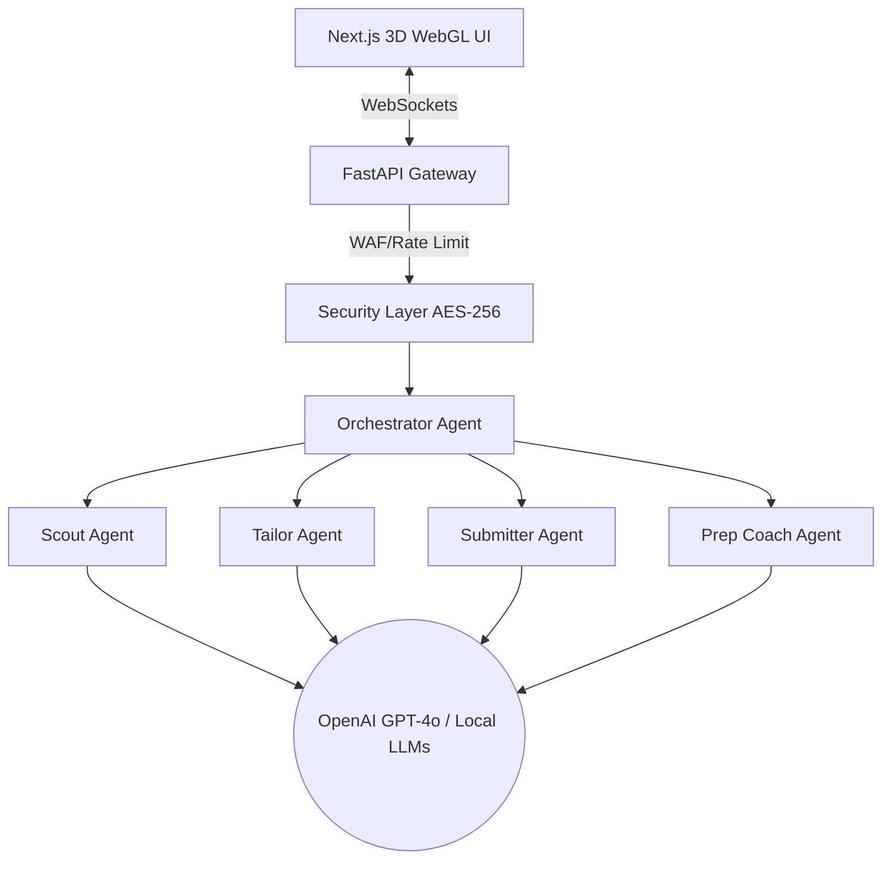

# 🌐 Multi AI Job Prep Agents 🚀

<div align="center">

[](https://opensource.org/licenses/MIT)
[](https://www.python.org/downloads/)
[](https://nextjs.org/)
[](https://docs.pmnd.rs/react-three-fiber/)
[](https://crewai.com/)
[]()

*一个超现实的、3D 多智能体人工智能系统，旨在自动化整个求职和申请过程。*

[English](README.md) • [Español](README.es.md) • [中文](README.zh.md)

</div>

---

## 🎮 3D 空间工作引擎（实时动态可视化器）

以下是实时运行的 **等距 3D WebGL 画布** 的实时模拟。观看各个立方体沿着神经管道进行呼吸、弹跳和脉冲式发光！

<div align="center">
  
</div>

---

## 🏗️ 系统架构

我们的多智能体协同架构从岗位发现到最终准备文档，实现了全流程无缝流转：



---

## 🛠️ 模块介绍

点击下方标题可展开查看系统各个模块的详细内容与配置参数：

<details>
<summary><b>🧠 1. 多智能体 AI 核心 (CrewAI & LangChain)</b></summary>
<br>

系统核心是由 7 个专业智能体组成的并行流水线，配置于 `backend/app/agents/crew.py`。每个智能体都具备专属角色与行动目标：

*   **🕵️ 侦察员 (The Scout):** 根据特定的岗位关键词和过滤条件，自动检索最新的求职信息。
*   **👔 裁缝 (The Tailor):** 重新编写和润色简历，确保关键词匹配率高，规避传统的 ATS 过滤系统限制（达到 94% 以上分值）。
*   **📝 问题解决者 (Problem Solver):** 使用智能上下文推理，为在线表单或技术选择题提供即时答案。
*   **📂 档案管理员 (The Archivist):** 将所有输出的 PDF、JSON 及 Word 格式的定制文档分类并安全存档。
*   **🔄 回收员 (The Recycler):** 创建本地知识缓存，用以加速未来相似岗位的申请流程。
</details>

<details>
<summary><b>🎮 2. WebGL 交互式 3D 画布层 (React Three Fiber & Three.js)</b></summary>
<br>

前端仪表盘采用等距 3D 画布，将 WebSocket 的数据流实时转化为可视化的物理反馈：
*   **动态移动着色器:** 基于 `useFrame` 物理循环，使节点产生规律的呼吸与浮动，并稳定在 60 FPS 的流畅度。
*   **轨道控制:** 支持鼠标拖拽旋转、缩放以及设定视口边界以提供最佳视角。
*   **交互式 HTML 覆盖层:** 在 3D 节点转换 `IDLE` (空闲)、`WORKING` (工作中) 或 `ERROR` (异常) 状态时，弹出跟随节点的动态气泡。
</details>

<details>
<summary><b>🔒 3. 零信任安全防护栈 (AES-256 & SlowAPI)</b></summary>
<br>

系统引入企业级安全控制方案，用以严密保护求职者的敏感个人隐私数据：
*   **双重加密信封:** 所有上传的凭证与配置文件写入磁盘时，均经由 `backend/app/core/security.py` 的 AES-256 算法高强度加密。
*   **WAF 流量限制 (SlowAPI):** 接口默认限制单 IP 每分钟 100 次请求，有效预防 DDoS 攻击和恶意刷取 API 额度。
*   **严格 CORS 域限制:** 后端 FastAPI 严格拒绝任何非本地前端端口 `3000` 之外的请求。
</details>

---

## 💻 跨平台环境搭建指南

### 1. Windows 系统 (PowerShell 与 命令提示符)

在 Windows 本地激活虚拟环境并运行项目：

```powershell
# 打开终端并导航至后端目录
cd backend

# 创建虚拟环境（如果尚未创建）
python -m venv venv

# 在 PowerShell 中，临时允许脚本执行策略
Set-ExecutionPolicy -Scope Process -ExecutionPolicy Bypass

# 激活虚拟环境
.\venv\Scripts\activate

# 安装后端依赖库
pip install -r requirements.txt

# 启动 FastAPI 后端服务
uvicorn app.main:app --reload --port 8000
```

*前端配置:*
```cmd
cd frontend
npm install
npm run dev
```

---

### 2. macOS & Linux 系统 (Bash 与 Zsh)

确保您本地环境的 Python 版本为 3.10+：

```bash
# 导航至后端目录
cd backend

# 创建虚拟环境
python3 -m venv venv

# 激活虚拟 environment
source venv/bin/activate

# 安装相关依赖包
pip install --upgrade pip
pip install -r requirements.txt

# 运行服务器
uvicorn app.main:app --reload --port 8000
```

*前端配置:*
```bash
cd frontend
npm install
npm run dev
```

---

### 3. 容器化一键部署 (Docker 与 Docker Compose)

项目自带了一键运行的 `docker-compose.yml` 配置文件，能在一台安装了 Docker 的设备上快速初始化全栈服务：

```bash
# 导航至含有 docker-compose.yml 的根目录
docker-compose up --build
```
容器构建完毕后，会自动在 `http://localhost:8000` 映射后端、`http://localhost:3000` 映射前端，并打通容器内部的 WebSocket 通讯渠道。

---

## 📊 协同智能体运作矩阵

以下是后端编排器所管控的 8 个协同智能体的技术详情：

| 智能体标识 | 运作角色 | 核心业务目标 | 实时状态流报文 |
| :--- | :--- | :--- | :--- |
| `agent_1_scout` | 侦察员 | 寻找匹配设定条件的在线岗位。 | `"Scouted target vacancies matching..."` |
| `agent_2_tailor` | 裁缝 | 润色简历，使关键词规避 ATS 过滤。 | `"Tailored resume for matching keywords. ATS: 97%"` |
| `agent_3_submitter` | 提交者 | 汇总输出信息并准备提交载荷。 | `"Prepared submission payload..."` |
| `agent_3_1_solver` | 问题解决者 | 即时解答技术考核或表单逻辑选择题。 | `"Generated answers for technical assessments."` |
| `agent_4_coach` | 面试教练 | 生成求职信与高度定制的面试指南。 | `"Generated cover letter and custom prep links."` |
| `agent_5_archivist` | 档案管理员 | 将生成的文档和配置进行高强度存档。 | `"Archived tailored resume and prep guides."` |
| `agent_6_recycler` | 回收员 | 缓存高频关键词和表单字段格式。 | `"Updated cache repositories with keyword patterns."` |
| `agent_7_orchestrator` | 编排器 | 调度长连接套接字并运转智能体。 | `"Pipeline successfully completed."` |

---

## 🔌 API 接口与 WebSocket 数据规范

后端数据服务在 SlowAPI 的节流保护下运行。点击标题以查看具体的数据通讯格式：

<details>
<summary><b>📡 1. POST /api/trigger-pipeline (Multipart 表单数据提交)</b></summary>
<br>

前端交互面板通过此接口向后端提交岗位关键词和简历附件。

*   **请求类型:** `POST`
*   **请求头:** `Content-Type: multipart/form-data`
*   **表单参数:**
    *   `jobDescription` (字符串, 必填): 目标岗位需求文本。
    *   `resume` (文件, 选填): 求职者的基础版简历。
*   **响应格式 (200 OK):**
    ```json
    {
      "message": "Pipeline triggered successfully. Watch the 3D UI!"
    }
    ```
</details>

<details>
<summary><b>📡 2. WS /ws/agents (长连接套接字)</b></summary>
<br>

持续将智能体当前的运作信息和最后生成的面试准备报告推送到前端等距 3D 画布。

*   **长连接地址:** `ws://localhost:8000/ws/agents`
*   **运作状态推送格式:**
    ```json
    {
      "agent_id": "agent_1_scout",
      "status": "WORKING",
      "message": "The Scout is actively processing..."
    }
    ```
*   **流水线完成推送事件格式 (`PIPELINE_COMPLETE`):**
    ```json
    {
      "event": "PIPELINE_COMPLETE",
      "atsMatchScore": 97,
      "jobTitle": "React 19 Frontend Lead",
      "coverLetter": "Dear Hiring Manager...",
      "technicalAnswers": [
        { "q": "Question text...", "a": "Answer text..." }
      ],
      "prepLinks": [
        { "title": "LeetCode Algorithmic Route", "url": "https://..." }
      ]
    }
    ```
</details>

---

## 🛠️ 本地运行常见故障排查手册

如果服务部署期间遇到冲突，可以展开以下条目定位并快速解决：

<details>
<summary><b>🔍 1. Pydantic ValidationError (类型校验失败)</b></summary>
<br>

*   **异常表现:** 后端服务启动失败，报错提示：`pydantic_core._pydantic_core.ValidationError: 2 validation errors for Agent`。
*   **发生原因:** 您本地虚拟环境中的 LangChain 或 CrewAI 版本出现冲突，导致 Pydantic v2 对 Agent 的 `llm` 实例化类型校验失败。
*   **解决方法:** 在激活的虚拟环境中强行同步包的版本：
    ```powershell
    .\venv\Scripts\activate
    pip install --upgrade crewai langchain-core langchain-openai
    ```
</details>

<details>
<summary><b>🔍 2. 端口占用冲突 (Address Already in Use)</b></summary>
<br>

*   **异常表现:** 前端或后端终端报错：`listen EADDRINUSE: address already in use :::8000` 或 `:::3000`。
*   **发生原因:** 后台有残留的 uvicorn 或 next dev 服务仍在运行。
*   **解决方法:** 在 Windows PowerShell 终端中强行杀死占用该端口的 PID 进程：
    ```powershell
    # 释放占用 8000 端口的后台进程
    Get-Process -Id (Get-NetTCPConnection -LocalPort 8000).OwningProcess | Stop-Process -Force
    
    # 释放占用 3000 端口的后台进程
    Get-Process -Id (Get-NetTCPConnection -LocalPort 3000).OwningProcess | Stop-Process -Force
    ```
</details>

<details>
<summary><b>🔍 3. WebSocket 连接失败 (前端显示 WSS 状态为 "disconnected")</b></summary>
<br>

*   **异常表现:** 前端仪表盘左上角展示 `WSS: disconnected` 红色标识。
*   **发生原因:** FastAPI 后端服务挂起，或是 CORS 允许策略未被浏览器正常解析。
*   **解决方法:** 确认 `uvicorn` 在 `http://localhost:8000` 稳定运行，并检查 `backend/app/main.py` 中的 CORS 白名单策略。
</details>
